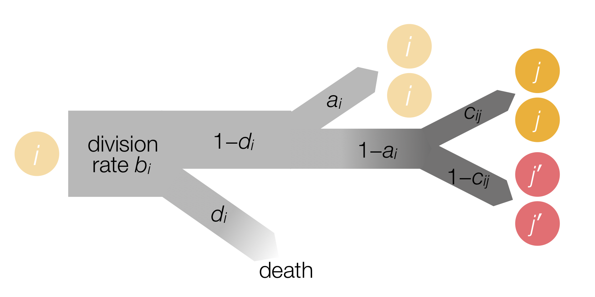

```{r setup, include=FALSE}
knitr::opts_chunk$set(
    echo = FALSE,
    cache = TRUE,
    fig.width = 3,
    fig.height = 3,
    fig.align = "center",
    dpi = 150,
    cache.extra = R.version.string
    )
source("../R/basicFunctions.R")
source("../R/simulateModel.R")
source("../R/plotFunctions.R")
```

<!--- Some latex macro defintions -->
\newcommand{\Mp}[1]{p^\prime_{#1}}
\newcommand{\Ma}[1]{a^\prime_{#1}}
\newcommand{\Mb}[1]{b^\prime_{#1}}
\newcommand{\Mc}[1]{c^\prime_{#1}}
\newcommand{\cC}{\mathcal{C}}
\newcommand{\McC}{\mathcal{C}^\prime}
\newcommand{\Md}[1]{d^\prime_{#1}}

## Mathematical model

We use mathematical modelling of the hematopoietic tissue to generate hypotheses related to the origin of the clonal structure observed in MPN patients with a low JAK2-V617F allele burden.
The general approach taken here is to construct a simple compartmental model of the hematopoietic system, and to then investigate what changes to the mutant's parameters can explain the observed mutant burden across the different cell compartments.
For simplicity we assume that there is no interaction between the cells and we rely on the steady-state approximation, representing the scenario of homeostasis.

### Definition

The compartmental model of hematopoiesis that we consider has previously been examined (albeit in the absence of mutants) [@marciniak-czochra:SCD:2009; @stiehl:MCM:2011; @brenes:PNAS:2011].
Each compartment $i \in \{1,...,m\}$ contains a number of wildtype (WT) cells, $x_i$.
Here $i=1$ corresponds to hematopoietic stem cells (HSC).

The cells in each compartment are homogeneous and indistinguishable.
Their dynamics are described by the parameter set $\{a_i, b_i, c_{ij}, d_i\}$, each of which is shown in the schematic in Fig. 1.
The division rate $b_i > 0$ sets the timescale for a cellular event to happen.
With probability $d_i$, the cell dies and is lost from the population.
With probability $1-d_i$, the cell undergoes division.
The fate of the two daughter cells is determined by the self-renewal probability $0 \le a_i \le 0.5$.
With probability $a_i$, the cells are of the same type as the parent (i.e. of type $i$).
With complimentary probability $1-a_i$, the cell generates two differentiated cells.

```{r, fig.cap="Figure 1. Model schematic illustrating division, self-renewal, differentiation, and branching."}

```

The cells that can be generated from type-$i$ cells is determined by the elements $c_{ij}$ of the matrix $\cC$.
If type-$i$ cells differentiate only into type-$j$ cells, then $c_{ij}=1$ and $c_{ik}=0$ for $k \ne j$.
If $i$ can differentiate into two cell types ($j$ and $j'$), then we have $c_{ij'}=1-c_{ij}$ where $0 < c_{ij} < 1$.
This branching is illustrated in the model schematic.

These dynamics can be described by the ordinary differential equations (ODE):
$$
\dot{x}_i = 2\sum_j b_j(1-d_j)(1-a_j)c_{ji}x_j - b_i[1-2a_i(1-d_i)]x_i,
$$
where the first term is the influx of cells differentiating from compartment $j$ into compartment $i$ and the second term is the net loss of cells into downstream compartments.
The same dynamics apply to the mutant cells, $y_i$, where the parameters are now given by $\{\Ma{i},\Mb{i},\Mc{ij},\Md{i}\}$.
Note that there is no interaction between the WT and mutant cells.

For simplicity, we first consider a linear population structure.
Here type-$1$ cells differentiate into type-$2$, which differentiate into type-$3$, etc.
Under these conditions, the dynamics are described by the simplified equations
$$
\begin{aligned}
    \dot{x}_i &= 2b_{i-1}(1-d_{i-1})(1-a_{i-1}) x_{i-1} - b_i[1 - 2 a_i(1-d_i)]x_i, \\
    \dot{y}_i &= 2\Mb{i-1}(1-\Md{i-1})(1-\Ma{i-1}) y_{i-1} - \Mb{i}[1 - 2 \Ma{i}(1-\Md{i})] y_i.
\end{aligned}
$$

<!---
### Dynamics
    
    ```{r odePlot, fig.width=6, fig.cap="\\label{fig:ode}Dynamics of the above ODEs, starting form $x_1=0.8$ and $y_1=0.2$, with all other compartments initially empty. Light colours are WT cells, while darker shades are the mutant cells. Parameters are identical for both WT and mutant cells. For identical parameters, the clonal fraction is preserved from the stem cells in all compartments."}
n <- 6
adj <- createAdjacency(n)

wt.ic <- c(0.8, rep.int(0, n-1))
mut.ic <- c(0.2, rep.int(0, n-1))

wt.div <- c(seq(from = 1.0, to = 3, length.out = n - 1), 1.0)
wt.sr <- c(0.5, rep.int(0.4, n - 2), 0.0)
wt.adj <- adj
wt.death <- c(0.0, rep.int(0.2, n - 1))

mut.div <- wt.div
mut.sr <- wt.sr
mut.adj <- wt.adj
mut.death <- wt.death

ode.sol <- integrateODE(
    times = seq(from = 0, to = 100, length.out = 101),
    wt.ic = wt.ic, mut.ic = mut.ic,
    wt.div = wt.div, mut.div = mut.div,
    wt.sr = wt.sr, mut.sr = mut.sr,
    wt.adj = wt.adj, mut.adj = mut.adj,
    wt.death = wt.death, mut.death = mut.death
)
plotODE(ode.sol)
```
-->

### Analysis
    
The above ODEs for the linear population structure permit the steady-state solution
$$
    \begin{aligned}
x_i^* &= \left[ \prod_{k=2}^i \frac{2(1-d_{k-1})(1-a_{k-1})}{1 - 2a_k(1-d_k)} \right] \frac{b_1}{b_i} x_1^*, \\
y_i^* &= \left[ \prod_{k=2}^i \frac{2(1-\Md{k-1})(1-\Ma{k-1})}{1 - 2\Ma{k}(1-\Md{k})} \right] \frac{\Mb{1}}{\Mb{i}} y_1^*.
\end{aligned}
$$
This solution exists only if $a_1 = \Ma{1} = 0.5$, and therefore $x_1$ and $y_1$ are unchanged in time.

We evaluate the clonal fraction in compartment $i$ as
$$
    z_i = \frac{y_i^*}{x_i^* + y_i^*}.
$$
If the parameters of the mutant cells are identical to the WT, i.e. $\Ma{i} = a_i$, $\Mb{i} = b_i$, and $\Md{i} = d_i$ $\forall i$, then the clonal fraction is preserved from the HSCs such that $z_i \equiv z_1$ $\forall i$.
What we want to know now is, how do the clonal fractions $z_i$ change as the mutant's parameters deviate from the WT's.
To answer this, we look at the derivatives of $z_i$ with respect to the parameters $\Mp{j}$, where $\Mp{j}$ can be any of $\Ma{j}$, $\Mb{j}$, or $\Md{j}$.
If the derivative is positive, then an increase of the parameter $\Mp{j}$ will lead to an increase in the clonal fraction $z_i$.
If negative, then an increasing parameter leads to a decrease in the clonal fraction.

The change of $z_i$ can be computed as follows:
$$
\begin{aligned}
\frac{\partial z_i}{\partial \Mp{j}}
&= \frac{\partial}{\partial \Mp{j}}\left(\frac{y_i^*}{x_i^*+y_i^*}\right) \nonumber\\
&= \frac{(x_i^*+y_i^*)\frac{\partial y_i^*}{\partial \Mp{j}} - y_i^*\left(\frac{\partial x_i^*}{\partial \Mp{j}} + \frac{\partial y_i^*}{\partial \Mp{j}}\right) }{(x_i^*+y_i^*)^2} \nonumber\\
&= \frac{x_i^*\frac{\partial y_i^*}{\partial \Mp{j}} - y_i^*\frac{\partial x_i^*}{\partial \Mp{j}}}{(x_i^*+y_i^*)^2} \nonumber\\
\end{aligned}
$$
As $x_i^*$ is independent of $\Ma{j}$ and $\Mb{j}$, we have $\partial x_i^* / \partial \Mp{j} = 0$.
Hence
$$
\frac{\partial z_i}{\partial \Mp{j}}
= \frac{x_i^*\frac{\partial y_i^*}{\partial \Mp{j}}}{(x_i^*+y_i^*)^2}
= \frac{(1-z_i)}{x_i^*+y_i^*} \frac{\partial y_i^*}{\partial \Mp{j}}
$$
Concretely, we evaluate the value of these derivates using identical parameters for the WT and mutant.
That is, we compute
$$
\left.\frac{\partial z_i}{\partial \Mp{j}}\right|_{\{\Mp{}\} = \{p\}}
= \frac{(1-z_i)}{x_i^*+y_i^*} \left.\frac{\partial y_i^*}{\partial \Mp{j}}\right|_{\{\Mp{}\} = \{p\}}
$$
Using the above expression for $y_i^*$, we can evaluate
$$
\begin{aligned}
\left.\frac{\partial z_i}{\partial \Ma{j}}\right|_{\{\Mp{}\} = \{p\}}
&= \left\{
\begin{matrix}
\dfrac{2(1-d_j) z_1(1-z_1)}{1-2a_j(1-d_j)} & \mbox{if}~~ i > 1 ~\mbox{and}~ j=i, \\
\dfrac{(1-2d_j) z_1(1-z_1)}{(1-a_j)[1-2a_j(1-d_j)]} & \mbox{if}~~ i >1 ~\mbox{and}~ 1 < j < i, \\
0 & \mbox{otherwise},
\end{matrix}
\right. \\ \nonumber
\left.\frac{\partial z_i}{\partial \Mb{j}}\right|_{\{\Mp{}\} = \{p\}}
&= \left\{
\begin{matrix}
\dfrac{z_1(1-z_1)}{b_1} & \mbox{if}~~ i > 1 ~\mbox{and}~ j=1, \\
-\dfrac{z_1(1-z_1)}{b_i} & \mbox{if}~~ i > 1 ~\mbox{and}~ j=i, \\
0 & \mbox{otherwise},
\end{matrix}
\right.  \\ \nonumber
\left.\frac{\partial z_i}{\partial \Md{j}}\right|_{\{\Mp{}\} = \{p\}}
&= \left\{
\begin{matrix}
-\dfrac{z_1(1-z_1)}{(1-d_j)[1-2a_j(1-d_j)]} & \mbox{if}~~ i > 1 ~\mbox{and}~ 1 < j < i, \\
-\dfrac{2 a_j z_1(1-z_1)}{1-2a_j(1-d_j)} & \mbox{if}~~ i > 1 ~\mbox{and}~ j=i, \\
0 & \mbox{otherwise},
\end{matrix}
\right. 
\end{aligned}
$$
where we have excluded changes to $\Ma{1}$ (which must equal $0.5$) and $\Md{1}$, otherwise the steady state does not exist.

## Results
We display results in terms of fractional changes of parameters, i.e. $\Delta p_i = (\Mp{i} - p_i)/p_i$.
We assume an initial clonal fraction of $z_1=0.1$ in the stem cell compartment.

### Varying division rates

```{r, echo=FALSE}
#' Parameter definitions for this section
n <- 6
adj <- createAdjacency(n)
#' Initial conditions
wt.ic <- c(0.9, rep.int(0, n-1))
mut.ic <- c(0.1, rep.int(0, n-1))
#' Wild-type cell parameters
wt.div <- c(seq(from = 1.0, to = 3.0, length.out = n - 1), 1.0)
wt.sr <- c(0.5, rep.int(0.4, n - 2), 0.0)
wt.adj <- adj
wt.death <- c(0, rep.int(0.2, n - 1))
#' Colours
colour.vec <- rep.int("#FA2D1C", n)
alpha.vec <- seq.int(0.2, 1, length.out = n)
#' Tree positions
y.pos <- rep.int(1, n)
tree.height <- 0.2
y.lim <- 0.5
```

We first consider the case that $\Ma{i} = a_i$ and $\Md{i} = d_i$ $\forall i$, and we vary the division rate parameters $\Mb{i}$.
From the above expression for $\partial z_i / \partial \Mb{1}$, we can see that increasing the division rate of mutant stem cells ($\Mb{1}$) results in an increased clonal fraction in all downstream compartments.
The fraction of mutants in the HSCs, however, remains unchanged (Fig. 2A).

On the other hand if the effect of the mutation is to increase the division rate in a single downstream compartment, then we expect a decrease in the observed clonal fraction within that compartment.
Compartments downstream of the modified cells retain the original clonal fraction from the HSCs (Fig. 2B).

By combining the above effects, we can observe late clonal expansions by considering multiple changes to the mutant division rates in all upstream compartments, but not the final one.
For example, all upstream mutant cells could divide twice as fast as their WT equivalent cells, while the final cells are unaffected.
The final clonal fraction is then determined by the effect in the HSC compartment, as shown below (Fig. 2C).

A late clonal expansion could also be explained by a reduction of the division rate of the final cells, which is essentially the rate of loss of the terminal cells.
This leads to cells piling up in the final compartment (Fig. 2D).
However, this is physiologically unlikely as these cell contain no DNA, and hence the mutants should be indistinguishable from their wildtype counterparts.

```{r divisionRate, fig.width = 12, fig.height = 3, fig.cap = "Figure 2. Effects of modifying division rates A. Faster dividing mutant stem cells result in an increased clonal fraction in all downstream compartments, but not in the stem cells. B. Faster dividing mutant cells (non-HSC) result in a lower clonal fraction in the modified compartment. All other fractions are preserved. C. If all non-TDC mutants divide twice as fast as the WT cells, then the clonal fraction in the TDCs is increased. D. Slower dividing final cells result in a late clonal expansion, although it is physiologically unlikely."}
#' "Faster dividing mutant stem cells result in an increased clonal fraction in all downstream compartments, but not in the stem cells."
#' Mutant cell parameters
mut.div <- wt.div
mut.div[1] <- 2 * wt.div[1]
mut.sr <- wt.sr
mut.adj <- wt.adj
mut.death <- wt.death
#' Steady state and clonal fraction
steadyState <- numericSteadyState(
    wt.ic = wt.ic, mut.ic = mut.ic,
    wt.div = wt.div, mut.div = mut.div,
    wt.sr = wt.sr, mut.sr = mut.sr,
    wt.adj = wt.adj, mut.adj = mut.adj,
    wt.death = wt.death, mut.death = mut.death
)
clonal.fraction <- getClonalFraction(steadyState)
#' Plot
fastHSC <- plotFractionParams(
    fraction.df = clonal.fraction,
    wt.div = wt.div, mut.div = mut.div,
    wt.sr = wt.sr, mut.sr = mut.sr,
    wt.adj = wt.adj, mut.adj = mut.adj,
    wt.death = wt.death, mut.death = mut.death,
    show.var = c("div"),
    colour.vec = rep.int("#FA2D1C", n), alpha.vec = seq.int(0.2, 1, length.out = n),
    show.tree = T, y.pos = y.pos, tree.height = tree.height, y.lim = y.lim
)


#' "Faster dividing mutant cells (non-HSC) result in a lower clonal fraction in the modified compartment. All other fractions are preserved."
#' Mutant cell parameters
mut.div <- wt.div
mut.div[4] <- 2 * wt.div[4]
mut.sr <- wt.sr
mut.adj <- wt.adj
mut.death <- wt.death
#' Steady state and clonal fraction
steadyState <- numericSteadyState(
    wt.ic = wt.ic, mut.ic = mut.ic,
    wt.div = wt.div, mut.div = mut.div,
    wt.sr = wt.sr, mut.sr = mut.sr,
    wt.adj = wt.adj, mut.adj = mut.adj,
    wt.death = wt.death, mut.death = mut.death
)
clonal.fraction <- getClonalFraction(steadyState)
#' Plot the data
fast4 <- plotFractionParams(
    fraction.df = clonal.fraction,
    wt.div = wt.div, mut.div = mut.div,
    wt.sr = wt.sr, mut.sr = mut.sr,
    wt.adj = wt.adj, mut.adj = mut.adj,
    wt.death = wt.death, mut.death = mut.death,
    show.var = c("div"),
    colour.vec = rep.int("#FA2D1C", n), alpha.vec = seq.int(0.2, 1, length.out = n),
    show.tree = T, y.pos = y.pos, tree.height = tree.height, y.lim = y.lim
)


#' "If all non-TDC mutants divide twice as fast as the WT cells, then the clonal fraction in the TDCs is increased."
#' Mutant cell parameters
mut.div <- 2 * wt.div
mut.div[6] <- wt.div[6]
mut.sr <- wt.sr
mut.adj <- wt.adj
mut.death <- wt.death
#' Steady state and clonal fraction
steadyState <- numericSteadyState(
    wt.ic = wt.ic, mut.ic = mut.ic,
    wt.div = wt.div, mut.div = mut.div,
    wt.sr = wt.sr, mut.sr = mut.sr,
    wt.adj = wt.adj, mut.adj = mut.adj,
    wt.death = wt.death, mut.death = mut.death
)
clonal.fraction <- getClonalFraction(steadyState)
#' Plot
fastMulti <- plotFractionParams(
    fraction.df = clonal.fraction,
    wt.div = wt.div, mut.div = mut.div,
    wt.sr = wt.sr, mut.sr = mut.sr,
    wt.adj = wt.adj, mut.adj = mut.adj,
    wt.death = wt.death, mut.death = mut.death,
    show.var = c("div"),
    colour.vec = rep.int("#FA2D1C", n), alpha.vec = seq.int(0.2, 1, length.out = n),
    show.tree = T, y.pos = y.pos, tree.height = tree.height, y.lim = y.lim
)


#' "Slower dividing final cells result in a late clonal expansion, although it is physiologically unlikely."
#' Mutant cell parameters
mut.div <- wt.div
mut.div[n] <- 0.5 * wt.div[n]
mut.sr <- wt.sr
mut.adj <- wt.adj
mut.death <- wt.death
#' Steady state and clonal fraction
steadyState <- numericSteadyState(
    wt.ic = wt.ic, mut.ic = mut.ic,
    wt.div = wt.div, mut.div = mut.div,
    wt.sr = wt.sr, mut.sr = mut.sr,
    wt.adj = wt.adj, mut.adj = mut.adj,
    wt.death = wt.death, mut.death = mut.death
)
clonal.fraction <- getClonalFraction(steadyState)
#' Plot
slow6 <- plotFractionParams(
    fraction.df = clonal.fraction,
    wt.div = wt.div, mut.div = mut.div,
    wt.sr = wt.sr, mut.sr = mut.sr,
    wt.adj = wt.adj, mut.adj = mut.adj,
    wt.death = wt.death, mut.death = mut.death,
    show.var = c("div"),
    colour.vec = rep.int("#FA2D1C", n), alpha.vec = seq.int(0.2, 1, length.out = n),
    show.tree = T, y.pos = y.pos, tree.height = tree.height, y.lim = y.lim
)


plot_grid(fastHSC, fast4, fastMulti, slow6, nrow = 1, labels = "AUTO")
```


### Varying death probability
From the above equations, we see that any change in the mutant cell's death parameter $\Md{i}$ decreases the clonal fraction in the modified compartment and has a bigger negative effect in all downstream compartments.
This is illustrated in Fig. 3A.
Therefore, as shown in Fig. 3B, a decrease in a mutant's death probability leads to an increase in the clonal fraction.
Under these conditions, late clonal expansions can be observed if the final progentior cells are less likely to die, as shown in Fig. 3C.

```{r death, fig.width = 9, fig.height = 3, fig.cap = "Figure 3. Effects of modifying the probability of death of mutant cells. A. Increasing the probability of death in compartment $i$ has a negative effect on the clonal fraction in that compartment, and a larger, but still negative, effect in all downstream compartments. B. Decreasing the probability of death in compartment $i$ increases the clonal fraction in this compartment and all those downstream. C. By decreasing the probability of death in the penultimate compartment (5), we can observe a late clonal expansion."}
#' Mutant cell parameters
mut.div <- wt.div
mut.sr <- wt.sr
mut.adj <- wt.adj
mut.death <- wt.death
mut.death[3] <- 0.4
#' Steady state and clonal fraction
steadyState <- numericSteadyState(
    wt.ic = wt.ic, mut.ic = mut.ic,
    wt.div = wt.div, mut.div = mut.div,
    wt.sr = wt.sr, mut.sr = mut.sr,
    wt.adj = wt.adj, mut.adj = mut.adj,
    wt.death = wt.death, mut.death = mut.death
)
clonal.fraction <- getClonalFraction(steadyState)
#' Plot
death3 <- plotFractionParams(
    fraction.df = clonal.fraction,
    wt.div = wt.div, mut.div = mut.div,
    wt.sr = wt.sr, mut.sr = mut.sr,
    wt.adj = wt.adj, mut.adj = mut.adj,
    wt.death = wt.death, mut.death = mut.death,
    show.var = c("death"),
    colour.vec = rep.int("#FA2D1C", n), alpha.vec = seq.int(0.2, 1, length.out = n),
    show.tree = T, y.pos = y.pos, tree.height = tree.height, y.lim = y.lim
)

#' Mutant cell parameters
mut.div <- wt.div
mut.sr <- wt.sr
mut.adj <- wt.adj
mut.death <- wt.death
mut.death[3] <- 0.05
#' Steady state and clonal fraction
steadyState <- numericSteadyState(
    wt.ic = wt.ic, mut.ic = mut.ic,
    wt.div = wt.div, mut.div = mut.div,
    wt.sr = wt.sr, mut.sr = mut.sr,
    wt.adj = wt.adj, mut.adj = mut.adj,
    wt.death = wt.death, mut.death = mut.death
)
clonal.fraction <- getClonalFraction(steadyState)
#' Plot
death3Minus <- plotFractionParams(
    fraction.df = clonal.fraction,
    wt.div = wt.div, mut.div = mut.div,
    wt.sr = wt.sr, mut.sr = mut.sr,
    wt.adj = wt.adj, mut.adj = mut.adj,
    wt.death = wt.death, mut.death = mut.death,
    show.var = c("death"),
    colour.vec = rep.int("#FA2D1C", n), alpha.vec = seq.int(0.2, 1, length.out = n),
    show.tree = T, y.pos = y.pos, tree.height = tree.height, y.lim = y.lim
)

#' Mutant cell parameters
mut.div <- wt.div
mut.sr <- wt.sr
mut.adj <- wt.adj
mut.death <- wt.death
mut.death[n - 1] <- 0.05
#' Steady state and clonal fraction
steadyState <- numericSteadyState(
    wt.ic = wt.ic, mut.ic = mut.ic,
    wt.div = wt.div, mut.div = mut.div,
    wt.sr = wt.sr, mut.sr = mut.sr,
    wt.adj = wt.adj, mut.adj = mut.adj,
    wt.death = wt.death, mut.death = mut.death
)
clonal.fraction <- getClonalFraction(steadyState)
#' Plot
death5 <- plotFractionParams(
    fraction.df = clonal.fraction,
    wt.div = wt.div, mut.div = mut.div,
    wt.sr = wt.sr, mut.sr = mut.sr,
    wt.adj = wt.adj, mut.adj = mut.adj,
    wt.death = wt.death, mut.death = mut.death,
    show.var = c("death"),
    colour.vec = rep.int("#FA2D1C", n), alpha.vec = seq.int(0.2, 1, length.out = n),
    show.tree = T, y.pos = y.pos, tree.height = tree.height, y.lim = y.lim
)


plot_grid(death3, death3Minus, death5, nrow = 1, labels = "AUTO")
```


### Varying self-renewal probabilities
Under the condition that $\Mb{i} = b_i$ $\forall i$, all mutant cells divide at the same rate as their WT counterparts.
As $0 \le a_j < 0.5$ and $0 \le d_j < 1$, all derivatives of $z_{i>1}$ with respect to $\Ma{j}$ are positive for $i \ge j$.
Therefore the clonal fraction increases in the compartment in which the mutants have a higher probability of self-renewal, as well as in all compartments downstream of this.
Furthermore, we can see that the increase of clonal fraction is larger in the modified compartment than those downstream ($\partial z_i / \partial \Ma{i} > \partial z_{j>i} / \partial \Ma{i} > 0$).
This is illustrated in Fig. 4A.

Similarly, as shown in Fig. 4B, a decrease in mutant self-renewal probability results in a large decrease in the clonal fraction in the modified compartment and a smaller decrease in further downstream compartments.

Under these conditions, late clonal expansions can be observed if the final cells acquire an increased self-renewal propensity.
However, this is physiologically improbable as these cells have usually ejected their nucleus, and hence lack the machinery to replicate.
We can, however, consider the existence of an amplifying compartment prior to the last.
Such a compartment would generally not be classified (e.g., during colony counting assays), and so the mutant burdens would not be measured here.
Therefore, an increase of the self-renewal capacity in this compartment would lead to an increased clonal fraction here and also in the final downstream compartment, as shown in Fig. 4C.

```{r selfRenewal, fig.width = 9, fig.height = 3, fig.cap = "Figure 4. Effects of modifying the self-renewal probability of mutant cells. A. Increasing the self-renewal probability in compartment $i$ has a large positive effect on the clonal fraction in that compartment, and a smaller, but still positive, effect in all downstream compartments. B. Decreasing the self-renewal probability in compartment $i$ has a large negative effect on the clonal fraction in that compartment, and a smaller negative effect in all downstream compartments. C. By increasing the self-renewal probability in the amplifying compartment (5), we can observe a late clonal expansion."}
#' Mutant cell parameters
mut.div <- wt.div
mut.sr <- wt.sr
mut.sr[3] <- 0.49
mut.adj <- wt.adj
mut.death <- wt.death
#' Steady state and clonal fraction
steadyState <- numericSteadyState(
    wt.ic = wt.ic, mut.ic = mut.ic,
    wt.div = wt.div, mut.div = mut.div,
    wt.sr = wt.sr, mut.sr = mut.sr,
    wt.adj = wt.adj, mut.adj = mut.adj,
    wt.death = wt.death, mut.death = mut.death
)
clonal.fraction <- getClonalFraction(steadyState)
#' Plot
sr3 <- plotFractionParams(
    fraction.df = clonal.fraction,
    wt.div = wt.div, mut.div = mut.div,
    wt.sr = wt.sr, mut.sr = mut.sr,
    wt.adj = wt.adj, mut.adj = mut.adj,
    wt.death = wt.death, mut.death = mut.death,
    show.var = c("sr"),
    colour.vec = rep.int("#FA2D1C", n), alpha.vec = seq.int(0.2, 1, length.out = n),
    show.tree = T, y.pos = y.pos, tree.height = tree.height, y.lim = y.lim
)

#' Mutant cell parameters
mut.div <- wt.div
mut.sr <- wt.sr
mut.sr[3] <- 0.2
mut.adj <- wt.adj
mut.death <- wt.death
#' Steady state and clonal fraction
steadyState <- numericSteadyState(
    wt.ic = wt.ic, mut.ic = mut.ic,
    wt.div = wt.div, mut.div = mut.div,
    wt.sr = wt.sr, mut.sr = mut.sr,
    wt.adj = wt.adj, mut.adj = mut.adj,
    wt.death = wt.death, mut.death = mut.death
)
clonal.fraction <- getClonalFraction(steadyState)
#' Plot
sr3Minus <- plotFractionParams(
    fraction.df = clonal.fraction,
    wt.div = wt.div, mut.div = mut.div,
    wt.sr = wt.sr, mut.sr = mut.sr,
    wt.adj = wt.adj, mut.adj = mut.adj,
    wt.death = wt.death, mut.death = mut.death,
    show.var = c("sr"),
    colour.vec = rep.int("#FA2D1C", n), alpha.vec = seq.int(0.2, 1, length.out = n),
    show.tree = T, y.pos = y.pos, tree.height = tree.height, y.lim = y.lim
)

#' Mutant cell parameters
mut.div <- wt.div
mut.sr <- wt.sr
mut.sr[n - 1] <- 0.49
mut.adj <- wt.adj
mut.death <- wt.death
#' Steady state and clonal fraction
steadyState <- numericSteadyState(
    wt.ic = wt.ic, mut.ic = mut.ic,
    wt.div = wt.div, mut.div = mut.div,
    wt.sr = wt.sr, mut.sr = mut.sr,
    wt.adj = wt.adj, mut.adj = mut.adj,
    wt.death = wt.death, mut.death = mut.death
)
clonal.fraction <- getClonalFraction(steadyState)
#' Plot
sr5 <- plotFractionParams(
    fraction.df = clonal.fraction,
    wt.div = wt.div, mut.div = mut.div,
    wt.sr = wt.sr, mut.sr = mut.sr,
    wt.adj = wt.adj, mut.adj = mut.adj,
    wt.death = wt.death, mut.death = mut.death,
    show.var = c("sr"),
    colour.vec = rep.int("#FA2D1C", n), alpha.vec = seq.int(0.2, 1, length.out = n),
    show.tree = T, y.pos = y.pos, tree.height = tree.height, y.lim = y.lim
)


plot_grid(sr3, sr3Minus, sr5, nrow = 1, labels = "AUTO")
```


### Branched population structure and mutant lineage bias
```{r, echo=FALSE}
#' Parameter defintions for this section
n <- 6
adj <- createAdjacency(n, entries =
                           list(
                               c(1,2,1),
                               c(2,3,0.5), c(2,5,0.5),
                               c(3,4,1),
                               c(5,6,1)
                           )
)
#' Initial conditions
wt.ic <- c(0.9, rep.int(0, n - 1))
mut.ic <- c(0.1, rep.int(0, n - 1))
#' Wild-type cell parameters
wt.div <- seq(from = 1.0, to = 3, length.out = n)
wt.div[c(4,6)] <- wt.div[1]
wt.sr <- c(0.5, rep.int(0.4, n - 2), 0.0)
wt.adj <- adj
wt.death <- c(0, rep.int(0.1, n - 1))
```
The impact of modifying the lineage bias of mutant cells is quite predictable: If mutant cells are more prone to differentiating into one lineage, then the clonal fraction will increase in that lineage and decrease in the other.
This is shown in Fig. 5.

```{r branchingFraction, fig.width = 3, fig.height = 3, fig.cap="Figure 5. Increasing the mutant's differetiation bias towards compartments 3 and 4 leads to a larger clonal fraction in that lineage, and a decreased burden in compartments 5 and 6."}
#' Mutant cell parameters
mut.div <- wt.div
mut.sr <- wt.sr
mut.adj <- wt.adj
mut.adj[2,3] <- 1.5 * wt.adj[2,3]
mut.adj[2,5] <- 1 - mut.adj[2,3]
mut.death <- wt.death
#' Steady state and clonal fraction
steadyState <- numericSteadyState(
    wt.ic = wt.ic, mut.ic = mut.ic,
    wt.div = wt.div, mut.div = mut.div,
    wt.sr = wt.sr, mut.sr = mut.sr,
    wt.adj = wt.adj, mut.adj = mut.adj,
    wt.death = wt.death, mut.death = mut.death
)
clonal.fraction <- getClonalFraction(steadyState)
#' Plot the data
plotFractionParams(
    fraction.df = clonal.fraction,
    wt.div = wt.div, mut.div = mut.div,
    wt.sr = wt.sr, mut.sr = mut.sr,
    wt.adj = wt.adj, mut.adj = mut.adj,
    wt.death = wt.death, mut.death = mut.death,
    show.var = c("branch"),
    #colour.vec = ifelse(seq_len(n) <= 4, colourGradient(seq_len(n))[c(1:4)], colourGradient(seq_len(n), palette = "Greens")[c(3,4)]),
    colour.vec = ifelse(seq_len(n) <= 4, "#FDB12B", "#FA2D1C"), alpha.vec = c(0.4, 0.55, 0.7, 1.0, 0.7, 1.0),
    show.tree = T, y.pos = c(1,1,0,0,1,1), tree.height = 0.3, y.lim = -0.5
)
```

### Replicating experimental results
```{r, echo=FALSE}
name.vec <- c(`1` = "HSC", `2` = "CMP", `3` = "MEP", `4` = "MkP", `5` = "Meg", `6` = "PLT",
              `7` = "EP", `8` = "RET", `9` = "CFU-G", `10` = "GRA")
n <- length(name.vec)
adj <- createAdjacency(n, entries =
                           list(
                               c(1, 2, 1.0), #c(1, 4, 0.1),
                               c(2, 3, 0.5), c(2, 9, 0.5),
                               c(3, 4, 0.5), c(3, 7, 0.5),
                               c(4, 5, 1.0), c(5, 6, 1.0),
                               c(7, 8, 1.0),
                               c(9, 10, 1.0)
                           )
)
y.pos <- c(1,1,0,-1,-1,-1,0,0,1,1)
#colour.vec <- ifelse(seq_len(n) <= 6, "#FDB12B", ifelse(seq_len(n) <= 8, "#FA2D1C", "#919191"))
colour.vec <- ifelse(seq_len(n) <= 3, "#FDB12B", ifelse(seq_len(n) <= 6, "#B97E42", ifelse(seq_len(n) <= 8, "#FA2D1C", "#919191")))

#' Initial conditions
wt.ic <- c(0.99, rep.int(0, n - 1))
mut.ic <- c(0.01, rep.int(0, n - 1))
#' Wild-type cell parameters
# wt.div <- seq(from = 1.0, to = 3, length.out = n)
# wt.div[c(6,9,11)] <- wt.div[1]
# wt.sr <- seq(from = 0.5, to = 0.0, length.out = n)
wt.div <- c(1.0, 1.4, 1.8, 2.2, 2.6, 2.0, 2.2, 1.0, 2.8, 2.0)
wt.sr <- c(0.5, 0.3, 0.3, 0.3, 0.3, 0.0, 0.3, 0.0, 0.3, 0.0)
wt.adj <- adj
wt.death <- c(0, rep.int(0.2, n - 1))
wt.death[7] <- 0.6 # Higher due to lack of EPO
```

The results in Figure 3B of the manuscript suggest that the mutant fraction of platelets constantly increases during differentiation.
This lineage deviates from the erythrocytes at the MEP stage.
The erytrocyte progenitors (EP) downstream of the MEPs have a lower mutant burden than the platelet progenitors (MkP).
The granulocyte progenitors (CFU-G) branch away from the megakaryocyte-erythrocyte lineage at the CMP stage, and maintain a small mutant fraction throughout.
We now use our model to address how the combined platelet and erythrocyte observations could be explained.
To this end we use the following population structure, which has adds extra parameters $c_{2,3}$ (CMP to MEP) and $c_{3,4}$ (MEP to MkP).
Here the megakaryocytes (Meg) function as an amplifying compartment for the platelets (PLT).

```{r branchedPop, fig.height=1.5, fig.width=6, fig.cap="Figure 6. The branched population structure we consider."}
plotTree(adj, y.pos, show.diff = F, colour.vec = colour.vec, alpha.vec = NULL, compartment.names = name.vec, lab.offset = -0.3, y.lim = -2.1) +
    theme(plot.margin = unit(c(0, 0, -0.2, 0), "npc"))
```


We can combine the above results to construct a scenario which qualitatively matches the experimental observations.
For example, increasing the division rate early in the hierarchy leads to an increasing mutant burden.
Increasing the mutant's bias towards the platelet lineage (less differentiation to erythrocytes) can then explain the lower burden in erythrocyte progenitors compared to the platelet lineage.
The clonal expansion in both the platelet and reticulocytes could be explained by increased amplification prior to cells reaching the terminal stage, and by having a reduced probability of death.

```{r branchingObs, fig.height=5, fig.width=7, fig.cap="Figure 7. Example to reproduce experimental observations of increasing mutant burden in the platelet lineage, while decreasing the burden in the EP compartment, and late clonal expansions in both lineages."}
#' Mutant cell parameters
mut.div <- wt.div
mut.div[1] <- 1.8 * wt.div[1]
mut.div[2] <- 1.8 * wt.div[2]
mut.div[3] <- 1.8 * wt.div[3]
mut.div[4] <- 1.8 * wt.div[4]
mut.div[5] <- 1.8 * wt.div[5]
mut.div[7] <- 2.0 * wt.div[7]
mut.div[9] <- 1.8 * wt.div[9]

mut.sr <- wt.sr
mut.sr[5] <- 0.49
mut.sr[7] <- 0.46

mut.adj <- wt.adj
#mut.adj[2,3] <- 1.3 * wt.adj[2,3]
#mut.adj[2,9] <- 1 - mut.adj[2,3]
mut.adj[3,4] <- 1.4 * wt.adj[3,4]
mut.adj[3,7] <- 1 - mut.adj[3,4]

mut.death <- wt.death
mut.death[5] <- 0.1
mut.death[7] <- 0.1
#mut.death[8] <- 0

#' Steady state and clonal fraction
steadyState <- numericSteadyState(
    wt.ic = wt.ic, mut.ic = mut.ic,
    wt.div = wt.div, mut.div = mut.div,
    wt.sr = wt.sr, mut.sr = mut.sr,
    wt.adj = wt.adj, mut.adj = mut.adj,
    wt.death = wt.death, mut.death = mut.death
)
clonal.fraction <- getClonalFraction(steadyState)
#' Plot the data
plotFractionParams(
    fraction.df = clonal.fraction,
    wt.div = wt.div, mut.div = mut.div,
    wt.sr = wt.sr, mut.sr = mut.sr,
    wt.adj = wt.adj, mut.adj = mut.adj,
    wt.death = wt.death, mut.death = mut.death,
    colour.vec = colour.vec,
    #alpha.vec = ifelse(seq_len(n) %in% c(2,5,8), 0.6, 1),
    show.tree = T, y.pos = y.pos,
    compartment.names = name.vec, lab.offset = -0.35, y.lim = -1.75
)
```


### Alternative scenarios
While the "platelets and red cells biased" pattern is the most common among the patients shown in Fig. 3B of the main manuscript, other patterns are also possible and can be reproduced through the model.

#### P433 (gradual clonal expansion in the platelet lineage only)
By increasing the lineage bias of mutants towards the platelet lineage, and increasing the self-renewing potential of the MkPs, we can recreate the observation of patient P433.
```{r p433, fig.height=5, fig.width=7, fig.cap="Figure 8. Example to reproduce experimental observations of patient P433."}
#' Mutant cell parameters
mut.div <- wt.div
mut.div[1] <- 1.8 * wt.div[1]
mut.div[2] <- 1.8 * wt.div[2]
mut.div[3] <- 1.8 * wt.div[3]
mut.div[4] <- 1.8 * wt.div[4]
mut.div[5] <- 1.8 * wt.div[5]
mut.div[7] <- 2.0 * wt.div[7]
mut.div[9] <- 1.8 * wt.div[9]

mut.sr <- wt.sr
mut.sr[4] <- 0.49
mut.sr[5] <- 0.49
mut.sr[7] <- 0.46

mut.adj <- wt.adj
mut.adj[2,3] <- 0.7
mut.adj[2,9] <- 1 - mut.adj[2,3]
mut.adj[3,4] <- 0.95
mut.adj[3,7] <- 1 - mut.adj[3,4]

mut.death <- wt.death
mut.death[5] <- 0.1
mut.death[7] <- 0.1
#mut.death[8] <- 0

#' Steady state and clonal fraction
steadyState <- numericSteadyState(
    wt.ic = wt.ic, mut.ic = mut.ic,
    wt.div = wt.div, mut.div = mut.div,
    wt.sr = wt.sr, mut.sr = mut.sr,
    wt.adj = wt.adj, mut.adj = mut.adj,
    wt.death = wt.death, mut.death = mut.death
)
clonal.fraction <- getClonalFraction(steadyState)
#' Plot the data
plotFractionParams(
    fraction.df = clonal.fraction,
    wt.div = wt.div, mut.div = mut.div,
    wt.sr = wt.sr, mut.sr = mut.sr,
    wt.adj = wt.adj, mut.adj = mut.adj,
    wt.death = wt.death, mut.death = mut.death,
    colour.vec = colour.vec,
    #alpha.vec = ifelse(seq_len(n) %in% c(2,5,8), 0.6, 1),
    show.tree = T, y.pos = y.pos,
    compartment.names = name.vec, lab.offset = -0.35, y.lim = -1.75
)
```

#### P328 (late clonal expansion in the erythroid lineage only)
By switching thelineage bias towards the red cells, we can replicate the pattern shown in patient P328.

```{r p328, fig.height=5, fig.width=7, fig.cap="Figure 9. Example to reproduce experimental observations of patient P328."}
#' Mutant cell parameters
mut.div <- wt.div
mut.div[1] <- 1.8 * wt.div[1]
mut.div[2] <- 1.8 * wt.div[2]
mut.div[3] <- 1.8 * wt.div[3]
mut.div[4] <- 1.8 * wt.div[4]
mut.div[5] <- 1.8 * wt.div[5]
mut.div[7] <- 2.0 * wt.div[7]
mut.div[9] <- 1.8 * wt.div[9]

mut.sr <- wt.sr
mut.sr[5] <- 0.49
mut.sr[7] <- 0.46

mut.adj <- wt.adj
mut.adj[2,3] <- 0.7
mut.adj[2,9] <- 1 - mut.adj[2,3]
mut.adj[3,4] <- 0.4
mut.adj[3,7] <- 1 - mut.adj[3,4]

mut.death <- wt.death
mut.death[5] <- 0.1
mut.death[7] <- 0.1
#mut.death[8] <- 0

#' Steady state and clonal fraction
steadyState <- numericSteadyState(
    wt.ic = wt.ic, mut.ic = mut.ic,
    wt.div = wt.div, mut.div = mut.div,
    wt.sr = wt.sr, mut.sr = mut.sr,
    wt.adj = wt.adj, mut.adj = mut.adj,
    wt.death = wt.death, mut.death = mut.death
)
clonal.fraction <- getClonalFraction(steadyState)
#' Plot the data
plotFractionParams(
    fraction.df = clonal.fraction,
    wt.div = wt.div, mut.div = mut.div,
    wt.sr = wt.sr, mut.sr = mut.sr,
    wt.adj = wt.adj, mut.adj = mut.adj,
    wt.death = wt.death, mut.death = mut.death,
    colour.vec = colour.vec,
    #alpha.vec = ifelse(seq_len(n) %in% c(2,5,8), 0.6, 1),
    show.tree = T, y.pos = y.pos,
    compartment.names = name.vec, lab.offset = -0.35, y.lim = -1.75
)
```

#### P393 (gradual increase in the platelet lineage and very late expansion in the erythroid lineage)
By increasing the self-renewing potential of the MkP cells, and decreasing their probability of death, we can recreate the pattern observed in patient P393.
```{r p393, fig.height=5, fig.width=7, fig.cap="Figure 10. Example to reproduce experimental observations of patient P393."}
#' Mutant cell parameters
mut.div <- wt.div
mut.div[1] <- 1.8 * wt.div[1]
mut.div[2] <- 1.8 * wt.div[2]
mut.div[3] <- 1.8 * wt.div[3]
mut.div[4] <- 1.8 * wt.div[4]
mut.div[5] <- 1.8 * wt.div[5]
mut.div[7] <- 2.0 * wt.div[7]
mut.div[9] <- 1.8 * wt.div[9]

mut.sr <- wt.sr
mut.sr[4] <- 0.49
mut.sr[5] <- 0.49
mut.sr[7] <- 0.46

mut.adj <- wt.adj

#mut.adj[2,3] <- 1.3 * wt.adj[2,3]
#mut.adj[2,9] <- 1 - mut.adj[2,3]
mut.adj[3,4] <- 1.4 * wt.adj[3,4]
mut.adj[3,7] <- 1 - mut.adj[3,4]

mut.death <- wt.death
mut.death[4] <- 0.1
mut.death[5] <- 0.1
mut.death[7] <- 0.1
#mut.death[8] <- 0

#' Steady state and clonal fraction
steadyState <- numericSteadyState(
    wt.ic = wt.ic, mut.ic = mut.ic,
    wt.div = wt.div, mut.div = mut.div,
    wt.sr = wt.sr, mut.sr = mut.sr,
    wt.adj = wt.adj, mut.adj = mut.adj,
    wt.death = wt.death, mut.death = mut.death
)
clonal.fraction <- getClonalFraction(steadyState)
#' Plot the data
plotFractionParams(
    fraction.df = clonal.fraction,
    wt.div = wt.div, mut.div = mut.div,
    wt.sr = wt.sr, mut.sr = mut.sr,
    wt.adj = wt.adj, mut.adj = mut.adj,
    wt.death = wt.death, mut.death = mut.death,
    colour.vec = colour.vec,
    #alpha.vec = ifelse(seq_len(n) %in% c(2,5,8), 0.6, 1),
    show.tree = T, y.pos = y.pos,
    compartment.names = name.vec, lab.offset = -0.35, y.lim = -1.75
)
```

## Accessibility

All code can be found at https://gitlab.ethz.ch/TB-aspeter/MPNBurden.git, which at the minute is hosted on an ETH server and may require special access for external collaborators.
This will be archived on Zenodo upon submission, and made publicly available before publication.

Furthermore, I created an interactive app to play around with the clonal fractoin.
This can be found at https://ibz-shiny.ethz.ch/ashcroft/MPNBurden/bb-code/Shiny/ClonalFractionMPN/.

## References
